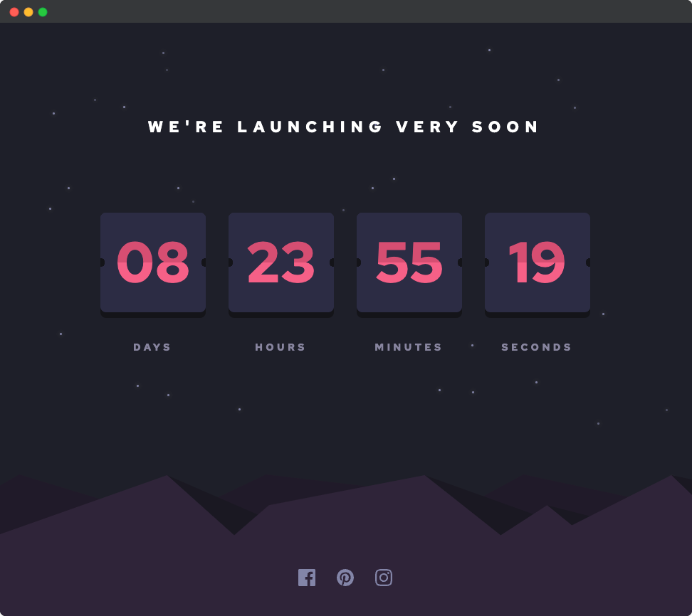

# FrontendMentor Challenge | Launch Countdown Timer

This is a challenge from FrontendMentor.   
You can find the description of the task here:  
https://www.frontendmentor.io/challenges/launch-countdown-timer-N0XkGfyz-



My goal in this challenge was to:
- use Sass as css pre-processor and to 
- use Gulp as task-runner

### How to run
```bash
git clone https://github.com/jeromehaas/launch-countdown-timer-fm.git
cd launch-countdown-timer-fm
nvm use
npm install 
npm start
```